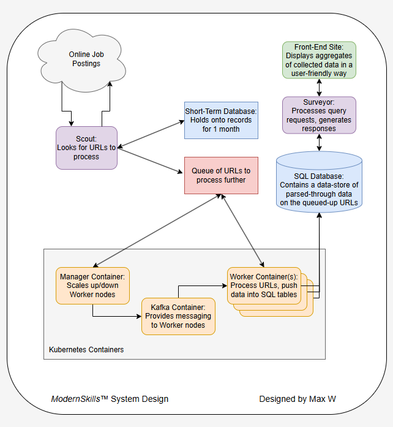

# Modern Skills

## About

This project was intended to become a web-crawler that took in job postings and scanned through their text, recording the skills requested in the job (i.e. experience with Python, specific certifications, specific technologies). The idea was to tabulate the data and determine which skills would be the most useful to pick up if an individual was job-seeking.

This project had some very interesting ideas related to capturing data over time. Someday, I may return to this project and explore those ideas further.

## System Design

This project was originally designed to give me more experience with specific technologies. In that way, function followed form. That being said, I do believe the design I came up with would scale well if this project was developed in a formal capacity.
